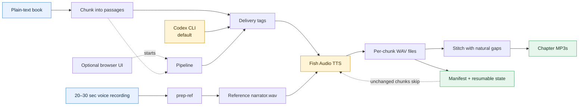

# Audio Forge Light

Turn a plain-text book and a short recording of your voice into chapter-by-chapter audiobook MP3s.

Audio Forge Light is a lightweight Windows-friendly narrator pipeline. It uses Fish Audio for hosted voice generation, so it needs no GPU, CUDA, PyTorch, or local model download. It chunks the book, adds optional delivery tags, generates resumable audio, and stitches the chapters with natural pauses.

## At a glance



The normal path is: provide a book and voice sample, prepare the reference, run the pipeline, and collect chapter MP3s. If a run is interrupted, the manifest lets the next run continue without regenerating unchanged chunks.

## The fastest path

### 1. Install the prerequisites

- Python 3.11+
- [FFmpeg](https://ffmpeg.org/) and `ffprobe` on your `PATH`
- A Fish Audio API key
- [Codex CLI](https://learn.chatgpt.com/docs/codex/cli), signed in with `codex login` (used by default for delivery tags)
- Node.js 18+ only if you want the browser interface

### 2. Install the narrator

```powershell
cd narrator
python -m venv .venv
.venv\Scripts\Activate.ps1
pip install -r requirements.txt
```

Create `narrator/.env`:

```text
FISH_API_KEY=your-fish-audio-key
```

### 3. Prepare your voice reference

Record 20–30 seconds of yourself reading normal prose in a quiet room, then convert it:

```powershell
python narrate.py prep-ref --input "C:\path\to\my-recording.m4a"
```

This creates `narrator/reference/narrator.wav`. Add `--clean` for light noise reduction. A matching transcript at `narrator/reference/narrator.txt` is optional but improves the clone.

### 4. Generate the audiobook

```powershell
python narrate.py run --book "C:\path\to\my-book.txt"
```

The default tagger uses your authenticated Codex CLI session. Sign in first:

```powershell
codex login
```

To disable delivery tags:

```powershell
python narrate.py run --book "C:\path\to\my-book.txt" --tagger none
```

## Where the audio goes

Generated files appear under:

```text
narrator/out/<book-name>/
|-- ch01/
|   |-- ch01_0001.wav
|   `-- manifest.json
|-- Chapter 01 - Title.mp3
|-- tags.json
`-- ...
```

Runs are resumable. If generation stops, run the same command again; completed chunks with unchanged text and tags are skipped.

## Browser interface

The CLI is the complete application. To use the optional local browser UI:

```powershell
cd narrator\server
npm install
node index.js
```

Open <http://localhost:3000> and choose the book, reference clip, and tagger.

## Useful commands

```powershell
# Stop after writing tags.json for review, before spending on TTS
python narrate.py run --book "C:\path\to\my-book.txt" --tags-review

# Process only a chapter range
python narrate.py run --book "C:\path\to\my-book.txt" --chapters ch01-ch03

# Re-stitch with a different pause without regenerating audio
python narrate.py stitch --book "C:\path\to\my-book.txt" --gap-ms 1100

# Use the OpenAI API tagger explicitly instead of Codex CLI
python narrate.py tag --book "C:\path\to\my-book.txt" --tagger codex --tag-model <model-id>
```

## What it is (and is not)

| Audio Forge Light does | Audio Forge Light does not |
|---|---|
| Narrate an entire `.txt` book in one cloned voice | Provide a cast of character voices |
| Produce chapter MP3s and per-chunk WAVs | Detect speakers or attribute dialogue |
| Resume after interruptions | Run a local GPU model |
| Retune pauses without regenerating audio | Accept PDF or DRM-protected books |

## Troubleshooting

- `FISH_API_KEY` errors: check `narrator/.env` and restart the command.
- `ffmpeg not found`: install FFmpeg and ensure both `ffmpeg` and `ffprobe` work in PowerShell.
- Codex CLI authentication errors: run `codex login`.
- Want no LLM delivery tags: add `--tagger none`.
- Want to inspect tags before TTS: add `--tags-review`.

The detailed workflow, configuration, pacing guidance, and troubleshooting notes are in [the full narrator guide](docs/simple-narrator-app/README.md).
