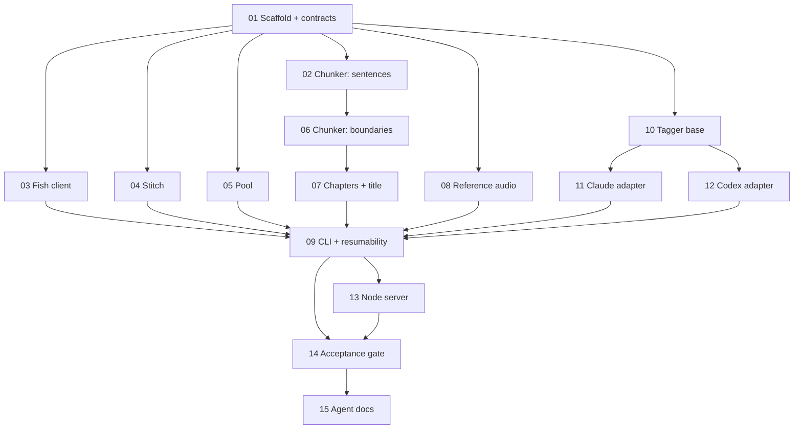

# Narrator — build tickets

`BUILD-PROMPT.md` is ~9,600 words. Handing all of it to one agent for one long session is
how you get drift: the chunker gets written correctly, then eight sections later the same
agent "simplifies" the concat demuxer back to the filter, or forgets that `text_hash` has
to cover the tag.

These tickets slice that spec into **15 units, each small enough for one focused session**,
each with its own passing test as the exit condition. An orchestrator hands out one ticket
at a time, reviews the diff against that ticket's Definition of Done, and only then
releases the next.

---

## How to use these

**Running tickets in parallel?** Read **[ORCHESTRATION.md](ORCHESTRATION.md)** first. It
covers branch-per-ticket, the shared-file freeze list, merge order, and what to do when two
agents collide. The waves below say *which* tickets can run together; that document says
*how* to run them without agents overwriting each other.

**For the orchestrator:**

1. Give the building agent **one ticket file** plus the named `BUILD-PROMPT.md` line range.
   Do not give it the whole build prompt — the line range is the point.
2. Require the agent to report back in the ticket's **Report back** format.
3. Review the diff against the **Definition of Done** before releasing the next ticket.
   The DoD is a runnable command, not a vibe.
4. If a ticket's tests don't pass, send it back. Do not proceed and "fix it later" — every
   downstream ticket assumes the upstream contract holds.

**Always include §1 as framing.** Give every agent `BUILD-PROMPT.md` **§1 (lines 24–59)**
in addition to its ticket's own range. It is 35 lines of goal and hard requirements, and it
is what stops an agent optimising in a direction the app doesn't want — no ticket owns it,
every ticket needs it.

**For the building agent:** read only your ticket, §1, and the line range your ticket names.
If you believe you need something outside that range, say so in your report rather than
reading ahead and expanding your own scope.

**Ticket 01 is blocking and must be done first.** It freezes the shared contracts (the
chunk record shape, the NDJSON event names, the module signatures) that every other ticket
composes against. Nothing parallelizes safely until it lands.

---

## The tickets

| # | Ticket | Owns these files | Spec | Depends on |
|---|---|---|---|---|
| 01 | [Scaffold + frozen contracts](T01-scaffold-and-contracts.md) | `config.json`, `.env.example`, `.gitignore`, `requirements.txt`, `models.py`, `events.py`, `preflight.py` | §2, §12, §3.6, §11 events | — |
| 02 | [Chunker: sentences + packing](T02-chunker-sentences-and-packing.md) | `chunker.py` | §3.1–3.2 | 01 |
| 03 | [Fish Audio client](T03-fish-client.md) | `fish_client.py` | §5 | 01 |
| 04 | [Stitching](T04-stitch.md) | `stitch.py` | §10 | 01 |
| 05 | [Adaptive concurrency pool](T05-pool.md) | `pool.py` | §8 | 01 |
| 06 | [Chunker: boundaries + merge](T06-chunker-boundaries-and-merge.md) | `chunker.py` | §3.3–3.6 | 02 |
| 07 | [Chapters + title chunk](T07-chapters-and-title-chunk.md) | `chunker.py` | §4 | 06 |
| 08 | [Reference audio + `prep-ref`](T08-reference-audio.md) | `refaudio.py`, `narrate.py` (one subcommand) | §7 | 01 |
| 09 | [CLI wiring + resumability](T09-cli-and-resumability.md) | `narrate.py` | §9, §11 contract, §12 precedence | 02–08 |
| 10 | [Tagger base + validator](T10-tagger-base-and-validator.md) ⚠️ critical path | `tagger/base.py` | §6.1, §6.4, §6.5 | 01 |
| 11 | [Claude tagger adapter](T11-tagger-claude.md) | `tagger/claude.py` | §6.2 | 10 |
| 12 | [Codex/OpenAI tagger adapter](T12-tagger-codex.md) | `tagger/codex.py` | §6.3 | 10 |
| 13 | [Node server wrapper](T13-node-server.md) | `server/` | §11 | 09 |
| 14 | [Acceptance gate](T14-acceptance-gate.md) | `tests/` (integration only) | §13 | 09, 13 |
| 15 | [Agent docs](T15-agent-docs.md) | `AGENTS.md`, `CLAUDE.md` | whole doc | 14 |

## Dependency graph

## Waves

Tickets in the same wave touch **disjoint files** and can be run in parallel.

| Wave | Tickets | Note |
|---|---|---|
| 0 | 01 | Blocking. Freezes every shared contract. |
| 1 | 02, 03, 04, 05, 08, 10 | Six disjoint modules. Widest parallel wave. |
| 2 | 06, 11, 12 | 06 continues `chunker.py`; 11/12 are separate adapter files. |
| 3 | 07 | Same file as 06 — must follow it, not run beside it. |
| 4 | 09 | The integration point. Single-threaded by nature. |
| 5 | 13 | |
| 6 | 14 | The real gate. |
| 7 | 15 | Docs last, written against what actually shipped. |

**File-conflict warning.** Three files have more than one owner across the set. None of
these pairs may run concurrently:

| File | Owners, in required order | Note |
|---|---|---|
| `chunker.py` | 02 → 06 → 07 | Each extends the last. 06 and 07 must re-run the earlier tickets' tests. |
| `narrate.py` | 08 → 09 | 08 adds **only** the `prep-ref` subcommand; 09 owns the rest of the CLI. |
| `README.md` | 14 → 15 | 14 adds the troubleshooting table; 15 corrects everything else against the shipped code. |

Every other file has exactly one owner, which is what makes the waves above safe to
parallelise — provided you also honour the **freeze list** in
[ORCHESTRATION.md](ORCHESTRATION.md) §2, which covers the files T01 creates and everyone
else imports.

## Tagging is core scope, and it is ON by default

Tickets 10–12 build the delivery-tag feature. It ships **enabled** (`--tagger auto`),
because tags carry the emotional cadence that makes the output sound like someone who has
read the book — untagged, every chunk lands in the same flat register.

This changes two things about how you sequence the set:

- **T10 is no longer optional.** Its validator is on the critical path of every default
  run: model-authored text now reaches the TTS input on the default path, and the
  validator is the only thing between that and a narrator reading stage directions aloud.
  Treat a T10 failure as a build blocker.
- **T09 must implement `auto` resolution**, not just accept a `--tagger` value:
  `ANTHROPIC_API_KEY` → claude; else `OPENAI_API_KEY` + `OPENAI_TAG_MODEL` → codex; else
  untagged **plus a printed recommendation**. `auto` degrades and never fails; an explicit
  `--tagger claude`/`codex` with a missing key **does** fail.

If you genuinely want the shortest path to first audio, you can still defer 10–12 and run
with `--tagger none` — but ship `compute_text_hash` tag-aware from T01 regardless, or
adding tags later will silently serve stale audio.

## The invariants every ticket inherits

Any agent, on any ticket, can break these. They are repeated in each ticket where they are
actually at risk, but the orchestrator should keep them in view during every review:

1. Never split a sentence in the chunker.
2. Never call the TTS on a chunk with no alphanumerics.
3. Delivery markers stay ≤ 32 chars and go through the shared validator — dropped, never
   truncated.
4. `text_hash` covers the applied tag.
5. Concat **demuxer** with a list file, never the concat filter.
6. Gaps are applied only at stitch time — never baked into a chunk, never a reason to
   regenerate audio.
7. The Fish model id goes in the `model` **header**, not the msgpack body.
8. Reference audio ships as raw bytes inside the msgpack map.
9. Keys never reach stdout, logs, or the NDJSON stream.
10. `anthropic` / `openai` are lazy imports inside their adapters.
11. No numpy, torch, or soundfile.
12. A failed chunk never kills the run.
